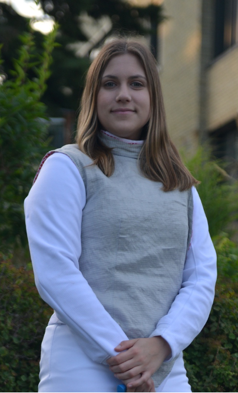

---
image:
  path: /images/Excelsior-logo.png
  type: image/png
  alt: Excelsior Fencing Club
description: "Excelsior Fencing Club"
site_name: "Excelsior Fencing Club"
title: "Excelsior Fencing Club"
---

# Our Coaches and Instructors

| [Brendan Thomas](mailto:brendan@excelsiorfencing.ca) Foil & Sabre                                                                                                                                                                                                                                                                                                                                                                                                                                                                                                                         | 
Head coach
                                                        |
| ----------------------------------------------------------------------------------------------------------------------------------------------------------------------------------------------------------------------------------------------------------------------------------------------------------------------------------------------------------------------------------------------------------------------------------------------------------------------------------------------------------------------------------------------------------------------------------------- | ---------------------------------------------------------------------------------- |
| Hello, everyone! My name is Brendan Thomas, and I’m thrilled to share my passion for fencing with you. With 24 years of fencing experience and 22 years as a coach, I specialize in Foil and Sabre, blending technical expertise with a problem-solving approach to instruction.   My goal is to create a safe, inclusive, and engaging environment where students of all levels can learn, grow, and enjoy the art of fencing. Whether you’re just starting out or aiming to refine your skills, I’m here to help you unlock your potential and develop both on and off the strip. |  |

| [Jon Holtz](mailto:jon@excelsiorfencing.ca) Sabre & Foil                                                                                                                                                                                                                                                                                                                                                                                                                                                                                                                                                                                                      |                                                          |
| ------------------------------------------------------------------------------------------------------------------------------------------------------------------------------------------------------------------------------------------------------------------------------------------------------------------------------------------------------------------------------------------------------------------------------------------------------------------------------------------------------------------------------------------------------------------------------------------------------------------------------------------------------------- | -------------------------------------------------------- |
| Jon started fencing in high school and continued with the sport into university where he was on the varsity team for 4 years and weapon captain. When he was finished with school, his travels led him to our K-W location. Jon is certified as an Aide-Moniteur coach in Foil and Sabre. Jon primarily helps with coaching and program development, but can also be persuaded to give private lessons, do high-school demonstrations, referee at tournaments, assist with referee development, and generally fill in the gaps when necessary. Jon's primary weapon is his wit, but he's also known to be pretty handy with a sabre when the fancy takes him. |  |

| [Callum Butterworth](mailto:callum@excelsiorfencing.ca) Epee                                                                                                                                                                                                                                                                                                                             |     |
| ---------------------------------------------------------------------------------------------------------------------------------------------------------------------------------------------------------------------------------------------------------------------------------------------------------------------------------------------------------------------------------------- | --- |
| Callum first took a stab at fencing in the fall of 2000 at Excelsior Fencing Club and has been fencing ever since. Callum has over a decade of coaching and refereeing experience and two decades of competitive epee experience. While he primarily fences epee, he also dabbles in sabre and foil from time to time. |  |

| [Jakob Grimshaw](mailto:jake@excelsiorfencing.ca) Sabre                                                                                                                                                                                                                                                                                                                                                                                                                                                                               |                                                                                               |
| ------------------------------------------------------------------------------------------------------------------------------------------------------------------------------------------------------------------------------------------------------------------------------------------------------------------------------------------------------------------------------------------------------------------------------------------------------------------------------------------------------------------------------------- | --------------------------------------------------------------------------------------------- |
| Coach Jake began his fencing journey over 25 years ago at Beaches Sabre Club in Toronto, where he competed in Junior and Cadet events for several years. After settling down in Waterloo many years later, he rejoined the sport at Excelsior as a way to stay active as a new parent and pay forward the positive experiences from his youth. Over the past decade, he has competed, coached, and officiated with the club at various levels in Ontario, sharing his passion and understanding of sabre with everyone along the way. |  |

| [Paul Joseph Godin](mailto:paul.joseph.godin@gmail.com) Foil & Epee                                                                                                                                                                                                                                                                                                                                                                |                                                                                   |
| ---------------------------------------------------------------------------------------------------------------------------------------------------------------------------------------------------------------------------------------------------------------------------------------------------------------------------------------------------------------------------------------------------------------------------------- | --------------------------------------------------------------------------------- |
| Paul has been fencing since 2005, with a primary focus on foil. He has served as an assistant coach at both the University of Toronto and York University, before joining Excelsior Fencing club. Additionally, Paul is the head coach at the University of Waterloo varsity fencing team and is a member of the OFA coaching committee. Paul has won OUA Men's Fencing Coach of the Year for the 2022-2023 and 2023-2024 seasons. |  |

| [Jackie Heitzner](mailto:jackieheitzner1414@gmail.com) Foil & Sabre                                                                                                                                                                                                                                                                                                          |                                                                                                  |
| ---------------------------------------------------------------------------------------------------------------------------------------------------------------------------------------------------------------------------------------------------------------------------------------------------------------------------------------------------------------------------- | ------------------------------------------------------------------------------------------------ |
| Jackie has been fencing since 2022, when she joined the fencing club and, subsequently, the varsity team at the University of Waterloo. She started with sabre, but then later switched to foil.  In 2023, she joined the club as an assistant coach, and has since become a full coach.  Jackie is also training to become a fencing referee in Epee and Sabre. |  |

| [Michael Ivankovic](mailto:michael.ivankovic@gmail.com) Foil & Epee                                                                                                                                                                                                                                                                                                                                                                                                                                                                                                                                                                                                                                                                                                                                                                                                                                                                                                                                                                                                                                                                                                                                                                                                                                                                                                                                                           |                                                                                                        |
| ----------------------------------------------------------------------------------------------------------------------------------------------------------------------------------------------------------------------------------------------------------------------------------------------------------------------------------------------------------------------------------------------------------------------------------------------------------------------------------------------------------------------------------------------------------------------------------------------------------------------------------------------------------------------------------------------------------------------------------------------------------------------------------------------------------------------------------------------------------------------------------------------------------------------------------------------------------------------------------------------------------------------------------------------------------------------------------------------------------------------------------------------------------------------------------------------------------------------------------------------------------------------------------------------------------------------------------------------------------------------------------------------------------------------------- | ------------------------------------------------------------------------------------------------------ |
| Coach Mike leads the competitive group at Excelsior, and has over thirty years of fencing experience as an athlete, coach, and referee. As a former National Squad member, he represented Canada at numerous World Cup and North American Cup events throughout his competitive career. He was a multiple time Provincial champion, Ontario University Champion and National medallist.  Coach Mike is also an active referee on the FIE (International Fencing Federation) Master List in Sabre, meaning that he regularly referees at World Cups, Grand Prix events and world/zonal championship events. He is certified in all three disciplines of fencing, as well as having experience refereeing at IWAS (International Wheelchair fencing) competitions in sabre and epee.  As a coach, he worked full time at the prestigious Laguna Fencing Center in Southern California from 2015-2021. During his time there, he worked alongside a highly respected group of coaches and olympians, leading countless fencers to medals at NACs and Nationals Championships in the US, Canadian National medallists and team members, as well as serving as a personal coach for a three time Veteran World Championships bronze medallist. Coach Mike is certified by the NCCP at the Introduction to competition level.   Coach Mike hopes to instill a passion for fencing and lifelong learning in sport. |  |

| [Hidde Koerts](mailto:hkoerts@uwaterloo.ca) Foil                                                                                                                                                                                                                                                                                                                                                                                                                                                                                                                |                                                   |
| --------------------------------------------------------------------------------------------------------------------------------------------------------------------------------------------------------------------------------------------------------------------------------------------------------------------------------------------------------------------------------------------------------------------------------------------------------------------------------------------------------------------------------------------------------------- | ------------------------------------------------- |
| Hidde first picked up a blade in 2010 in Amsterdam, and has rarely put it back down since. He fenced competitively in the various youth categories, before joining a university team which he captained for four years. Here he also first started taking on coaching responsibilities.      In 2021 Hidde moved to Waterloo for graduate studies, and joined the University of Waterloo men's foil varsity team. He began coaching at Excelsior in 2024, bringing a decade of competitive experience and a passion for developing fencers at all levels. |  |

---

# Coaching Alumni

- Paul Shull  
- Laura-Lee Spaetzel  
- Lester Wong  
- Dan Banks  
- Julian Twardus
