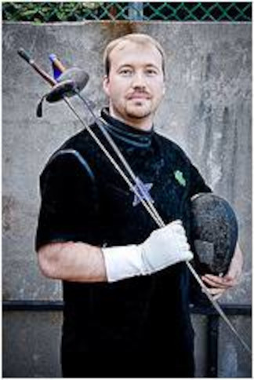
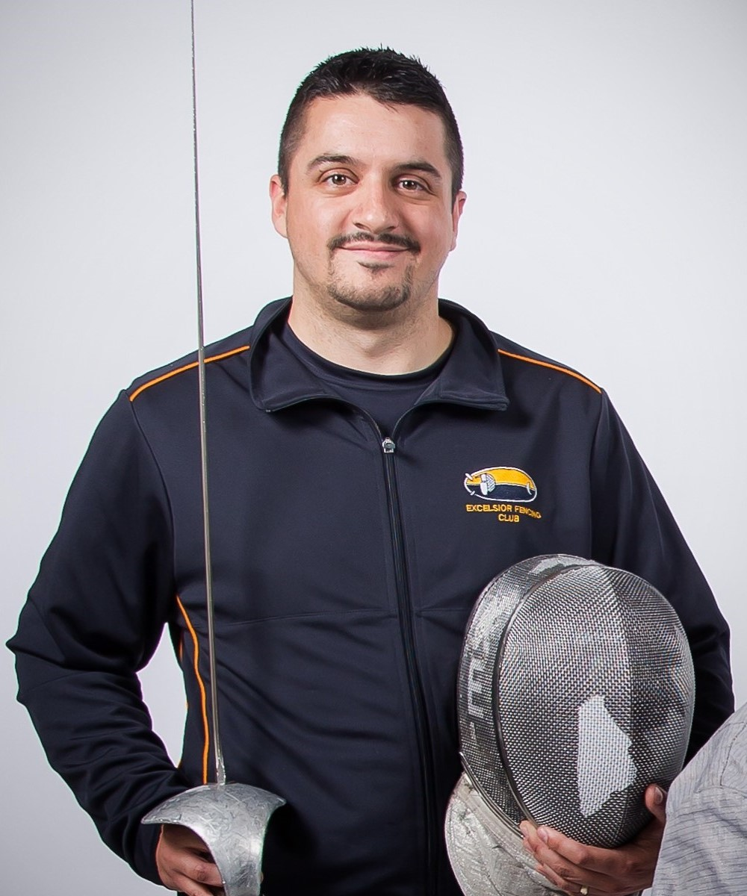
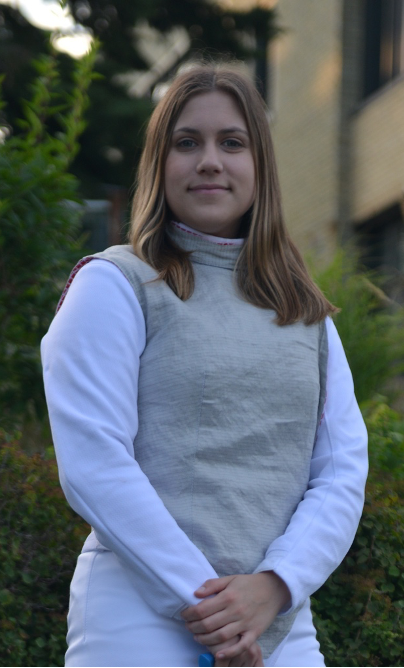
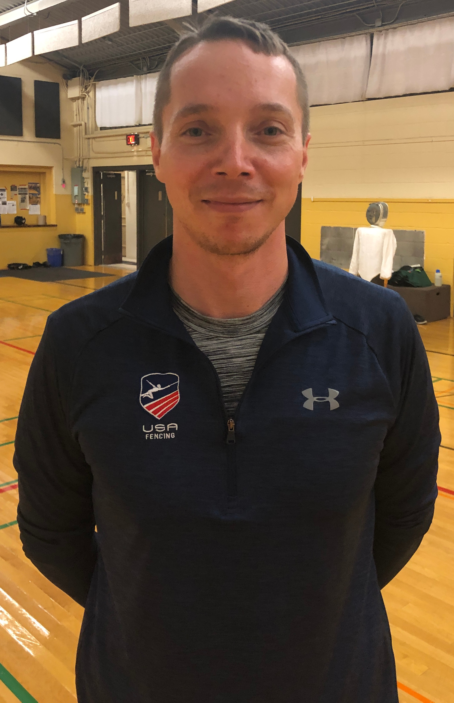

# Our Coaches and Instructors

---

## [Jon Holtz](mailto:jon@excelsiorfencing.ca)

| Sabre & Foil                                                                                                                                                                                                                                                                                                                                                                                                                                                                                                                                                                                                                                                  |                                                          |
| ------------------------------------------------------------------------------------------------------------------------------------------------------------------------------------------------------------------------------------------------------------------------------------------------------------------------------------------------------------------------------------------------------------------------------------------------------------------------------------------------------------------------------------------------------------------------------------------------------------------------------------------------------------- | -------------------------------------------------------- |
| Jon started fencing in high school and continued with the sport into university where he was on the varsity team for 4 years and weapon captain. When he was finished with school, his travels led him to our K-W location. Jon is certified as an Aide-Moniteur coach in Foil and Sabre. Jon primarily helps with coaching and program development, but can also be persuaded to give private lessons, do high-school demonstrations, referee at tournaments, assist with referee development, and generally fill in the gaps when necessary. Jon's primary weapon is his wit, but he's also known to be pretty handy with a sabre when the fancy takes him. |  |

## [Callum Butterworth](mailto:callum@excelsiorfencing.ca)

| Epee                                                                                                                                                                                                                                                                                                                                                                                     |     |
| ---------------------------------------------------------------------------------------------------------------------------------------------------------------------------------------------------------------------------------------------------------------------------------------------------------------------------------------------------------------------------------------- | --- |
| Callum teaches the yellow and orange armband classes as well as introductory epee. He recently graduated from the University of Waterloo after studying Computer Engineering.  Callum is a competitive epee fencer, who also plays around with foil and sabre. Callum first took a stab at fencing in the fall of 2000 and has been fencing ever since. Callum's primary weapon is epee. |     |

## [Jakob Grimshaw](mailto:jake@excelsiorfencing.ca) - Sabre

| Sabre                                                                                                                                                                                                                                                                                                                                                                                                                                                                                                                                 |                                                                                               |
| ------------------------------------------------------------------------------------------------------------------------------------------------------------------------------------------------------------------------------------------------------------------------------------------------------------------------------------------------------------------------------------------------------------------------------------------------------------------------------------------------------------------------------------- | --------------------------------------------------------------------------------------------- |
| Coach Jake began his fencing journey over 25 years ago at Beaches Sabre Club in Toronto, where he competed in Junior and Cadet events for several years. After settling down in Waterloo many years later, he rejoined the sport at Excelsior as a way to stay active as a new parent and pay forward the positive experiences from his youth. Over the past decade, he has competed, coached, and officiated with the club at various levels in Ontario, sharing his passion and understanding of sabre with everyone along the way. |  |

## [Brendan Thomas](mailto:brendan@excelsiorfencing.ca)

| Foil & Sabre |     |
| ------------ | --- |
|              |     |

## [Paul Joseph Godin](mailto:paul.joseph.godin@gmail.com)

| Foil & Epee                                                                                                                                                                                                                                                                                                                                                                                                                        |                                                                                   |
| ---------------------------------------------------------------------------------------------------------------------------------------------------------------------------------------------------------------------------------------------------------------------------------------------------------------------------------------------------------------------------------------------------------------------------------- | --------------------------------------------------------------------------------- |
| Paul has been fencing since 2005, with a primary focus on foil. He has served as an assistant coach at both the University of Toronto and York University, before joining Excelsior Fencing club. Additionally, Paul is the head coach at the University of Waterloo varsity fencing team and is a member of the OFA coaching committee. Paul has won OUA Men's Fencing Coach of the Year for the 2022-2023 and 2023-2024 seasons. |  |

## [Jackie Heitzner](mailto:jackieheitzner1414@gmail.com)

| Foil & Sabre                                                                                                                                                                                                                                                                                                                                                                 |                                                                                                  |
| ---------------------------------------------------------------------------------------------------------------------------------------------------------------------------------------------------------------------------------------------------------------------------------------------------------------------------------------------------------------------------- | ------------------------------------------------------------------------------------------------ |
| Jackie has been fencing since 2022, when she joined the fencing club and, subsequently, the varsity team at the University of Waterloo. She started with sabre, but then later switched to foil.  In 2023, she joined the club as an assistant coach, and has since become a full coach.  Jackie is also training to become a fencing referee in Epee and Sabre. |  |

## [Michael Ivankovic](mailto:michael.ivankovic@gmail.com)

| Foil & Epee       |                                                                |
| ----------------- | -------------------------------------------------------------- |
| Competitive coach |  |

---

# Coaching Alumni

- Paul Shull  
- Laura-Lee Spaetzel  
- Lester Wong  
- Dan Banks  
- Julian Twardus
